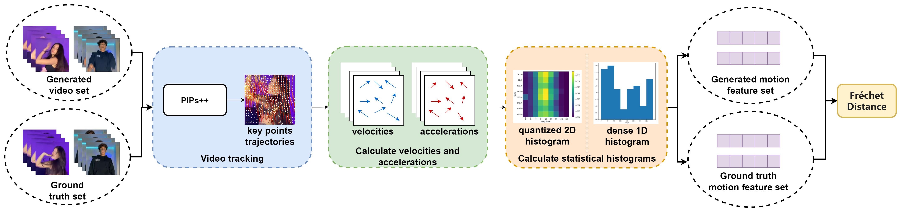
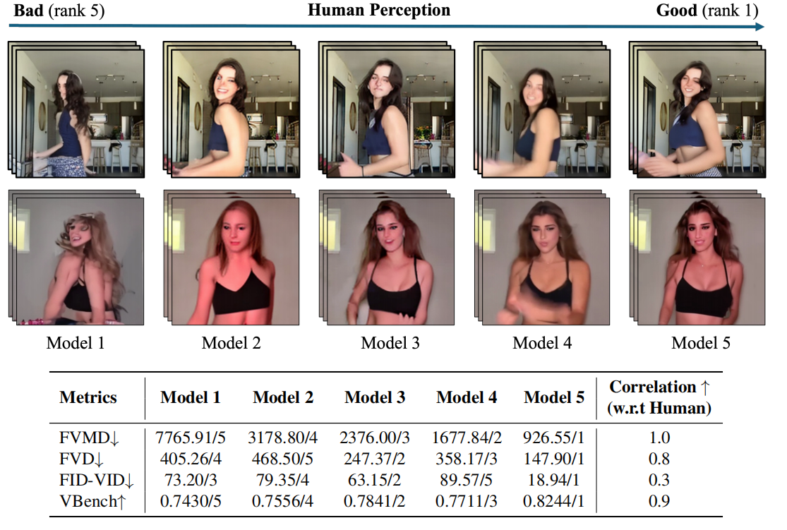

# FVMD Metric for Generated Videos
This repository contains the official implementation of the Fréchet video motion distance(FVMD) in PyTorch. 

[](https://arxiv.org/abs/2407.16124) [](https://pypi.org/project/fvmd/1.0.0/)


## 🔥 News

* [2024.07.01] FVMD has been accepted by ICML workshop. Please check the latest version of paper on [ArXiv](https://arxiv.org/abs/2407.16124).
* [2024.06.16] PyPI package is released. Simply `pip install fvmd`.
* [2024.06.16] Release the code for FVMD.


## 📝Overview

We propose the **Fréchet video motion distance(FVMD)**, a novel metric that focuses on the motion consistency of video generation. Our main idea is to measure motion temporal consistency based on **the patterns of velocity and acceleration** in video movements, as motions conforming to real physical laws should not exhibit sudden changes in acceleration. Specifically, we extract the motion trajectory of key points in videos using a pre-trained point tracking model, PIPs++ and compute the velocity and acceleration for all key points across video frames. We then obtain the motion features based on the statistics on the velocity and acceleration vectors. Finally, we measure the similarity between the motion features of generated videos and ground truth videos using Fréchet Distance. 



### Evaluation Results

We use the TikTok dataset to provide a quantitative comparison of various video evaluation metrics. Specifically, we generate 50 videos using different checkpoints named (a) through (e). The models (a) to (e) are sorted based on human ratings collected through a user study, from worse to better visual quality (model (e) has the best visual quality and model (a) has the worst). We can then compare how well the evaluation metrics align with human judgments.

<!--  -->
https://github.com/ljh0v0/FVMD-frechet-video-motion-distance/assets/32333051/378d9ee3-4243-4987-937e-ddbaa0631e83


| **Metrics**     | **Model (a)**  | **Model (b)**  | **Model (c)**  | **Model (d)**  | **Model (e)**  | **Human Corr.↑**|
|-----------------|----------------|----------------|----------------|----------------|----------------|---------------------------------|
| FID↓        | 73.20/3        | 79.35/4        | 63.15/2        | 89.57/5        | 18.94/1        | 0.3                             |
| FVD↓            | 405.26/4       | 468.50/5       | 247.37/2       | 358.17/3       | 147.90/1       | 0.8                             |
| VBench↑         | 0.7430/5       | 0.7556/4       | 0.7841/2       | 0.7711/3       | 0.8244/1       | 0.9                             |
| FVMD↓           | 7765.91/5      | 3178.80/4      | 2376.00/3      | 1677.84/2      | 926.55/1       | **1.0**                             |

In this table, we show the raw scores given by different metrics, which are computed by comparing a set of generated videos (as shown in the video above) to a set of reference videos. We report the corresponding ranking among the five models. The ranking correlation between the metrics evaluation and human ratings is also reported, where a higher value indicates better alignment with human judgments.

Our FVMD ranks the models correctly in line with human ratings and shows promising result for evaluating video generative models, especially when motion consistency is concerned.


## 🔨 Installation

#### Install with pip

```
pip install fvmd
```


#### Install with git clone

```
git clone https://github.com/ljh0v0/FVMD-frechet-video-motion-distance.git
pip install -r requirements.txt
```


## 🚀 Usage

#### Video Data Preparation

The input video sets can be either in `.npz` or `.npy` file formats with the shape `[clips, frames, height, width, channel]`, or a folder with the following structure:

```
Folder/
|-- Clip1/
|   |-- Frame1.png/jpg
|   |-- Frame2.png/jpg
|   |-- ...
|
|-- Clip2/
|   |-- Frame1.png/jpg
|   |-- Frame2.png/jpg
|   |-- ...
|
|-- ...
```


#### Evaluate FVMD

To evaluate the FVMD between two video sets, you can run our script:

```bash
python -m fvmd --log_dir <log_directory> <path/to/gen_dataset> <path/to/gt_dataset>
```

You can alose use our FVMD in your Python code:

```python
from fvmd import fvmd

fvmd_value = fvmd(log_dir=<log_directory>, 
                  gen_path=<path/to/gen_dataset>, 
                  gt_path=<path/to/gt_dataset>
                 )
```


#### Evaluate FVMD step by step

You can also run only some intermediate steps of FVMD.

##### Video Key Point Tracking

```python
from fvmd import track_keypoints

velocity_gen, velocity_gt, acceleration_gen, acceleration_gt = keypoint_tracking(log_dir= < log_directory >,
gen_path = < path / to / gen_dataset >,
gt_path = < path / to / gt_dataset >
            v_stride = < overlap_straide: default
1 >
)
```

##### Extract motion feature from velocity/acceleration fields 

```python
from fvmd import calc_hist

motion_feature = calc_hist(vectors=<velocity_gen/velocity_gt/acceleration_gen/acceleration_gt>)
```

##### Compute FVMD from velocity/acceleration fields

```python
from fvmd import calculate_fvmd_given_paths

results = calculate_fvmd_given_paths(gen_path=<directory/of/gen_velocity/acceleration_cache>, 
                                     gt_path=<directory/of/gt_velocity/acceleration_cache>
                                    )
```


## ✒️ Citation

If you find our repo useful for your research, please cite our paper:

```

```


## 📑 Reference

* [pytorch-fid](https://github.com/mseitzer/pytorch-fid)
* [PIPs++](https://github.com/aharley/pips2)


## ✉️ Contact

Please submit a Github issue or contact johannahliew@gmail.com if you have any questions or find any bugs.
